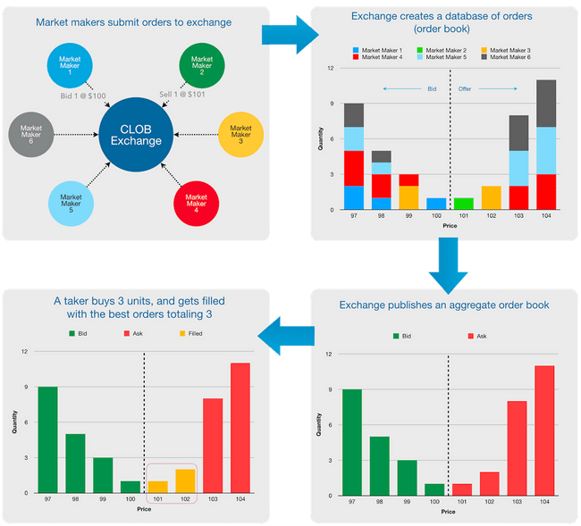

# Challenges of DEX

## What Problem Are We Trying to Solve?

The biggest problem with decentralized exchanges is its speed of execution, lack of advanced trading strategies ability and complex management. Here we propose a decentralized trading engine and order book with low latency and guaranteed trade execution. It is flexible — allowing extendable strategies, extremely fast — providing immediate execution and settlement of an order and both decentralized and distributed.

This allows Flex to perform on par with the Everscale blockchain performance. For example, an average execution across 128 threads will be 0.08 seconds at roughly 80,000 trading pairs messages per second throughput for one shardchain. It will take just 15 workchains to beat Binance performance and 150 workchains to compete with BATS exchange. Usage of DeBots makes it super easy to add simple or advanced user interfaces.

Flex is a decentralized and distributed limit order book (DLOB) which takes a most common centralized exchange model: central limit order book (CLOB) and implements it on-chain via a distributed smart contract model. Many have tried this approach before and failed (EtherDelta, DDEX, Radar Relay, etc.). Up until now the problem of creating an order book on chain were: the slow speed of execution and the possibility of front-running orders.

Some are trying to solve this by moving to the fastest possible blockchain. But just having a fast blockchain is not enough because usually order books are pretty large and complex which takes time to operate on. Flex distributed atomic contracts solve this problem distributing the load on the order book down to the price of a single pair.

Central exchanges using CLOB such as NYSE, CBOT, Coinbase, Binance operate in microsecond time frames. This is how it looks:

## **How are orders filled on CLOB?**

The most common algorithm used is Price/Time priority, aka FIFO: all orders at the same price level are filled according to time priority; the first order at a price level is the first order matched. Up until now there was a problem implementing this algorithm on a blockchain because transactions are usually prioritized by miners based on the gas fee they pay, allowing for front-running the Time priority. Everscale does not have these problems.

## **Why are CLOB hard to implement on a blockchain?**

The size of the state needed by an order book to represent the set of outstanding orders is large and extremely costly in the smart contract environment, where users must pay for space and compute power utilized.

The matching logic for order books is often complicated as it must often support several different order types (such as icebergs, good-till-cancel, and stop-limit orders.
